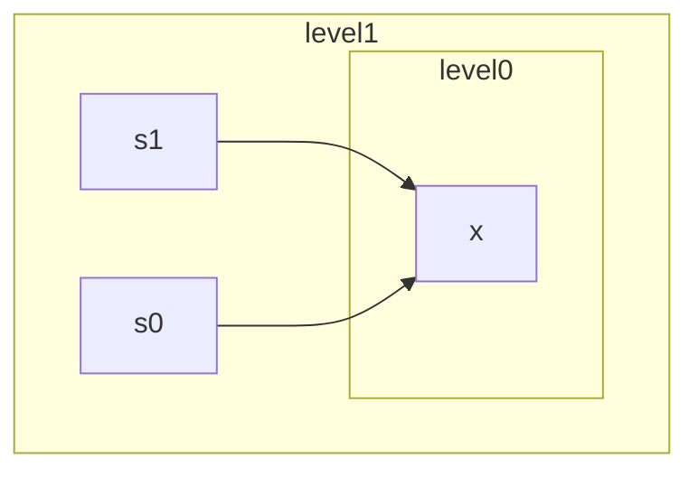

```mermaid
flowchart TD
  subgraph level1_138["level1"]
    s1_128["s1"]
    s0_129["s0"]
    subgraph level0_140["level0"]
      x_130["x"]
    end
  end

  s1_128 --> x_130;
  s0_129 --> x_130;

  classDef highlight fill:#FFFFAA,stroke:#333;
```