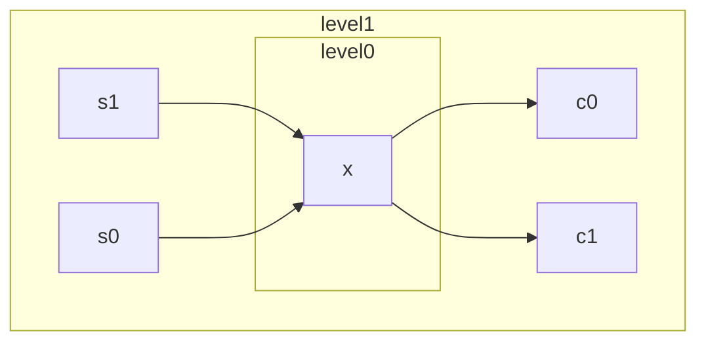

```mermaid
flowchart TD
  subgraph level1_83["level1"]
    s1_158["s1"]
    s0_159["s0"]
    c0_161["c0"]
    c1_162["c1"]
    subgraph level0_84["level0"]
      x_160["x"]
    end
  end

  s1_158 --> x_160;
  s0_159 --> x_160;
  x_160 --> c0_161;
  x_160 --> c1_162;

  classDef highlight fill:#FFFFAA,stroke:#333;
```