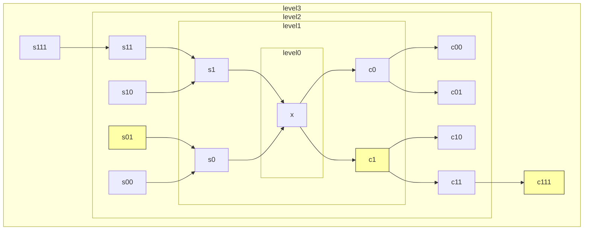

```mermaid
flowchart TD
  subgraph level3_190["level3"]
    s111_183["s111"]
    c111_197["c111"]:::highlight
    subgraph level2_192["level2"]
      s11_184["s11"]
      s10_185["s10"]
      s01_186["s01"]:::highlight
      s00_187["s00"]
      c00_193["c00"]
      c01_194["c01"]
      c10_195["c10"]
      c11_196["c11"]
      subgraph level1_194["level1"]
        s1_188["s1"]
        s0_189["s0"]
        c0_191["c0"]
        c1_192["c1"]:::highlight
        subgraph level0_196["level0"]
          x_190["x"]
        end
      end
    end
  end

  s111_183 --> s11_184;
  s11_184 --> s1_188;
  s10_185 --> s1_188;
  s01_186 --> s0_189;
  s00_187 --> s0_189;
  c11_196 --> c111_197;
  s1_188 --> x_190;
  s0_189 --> x_190;
  c0_191 --> c00_193;
  c0_191 --> c01_194;
  c1_192 --> c10_195;
  c1_192 --> c11_196;
  x_190 --> c0_191;
  x_190 --> c1_192;

  classDef highlight fill:#FFFFAA,stroke:#333;
```