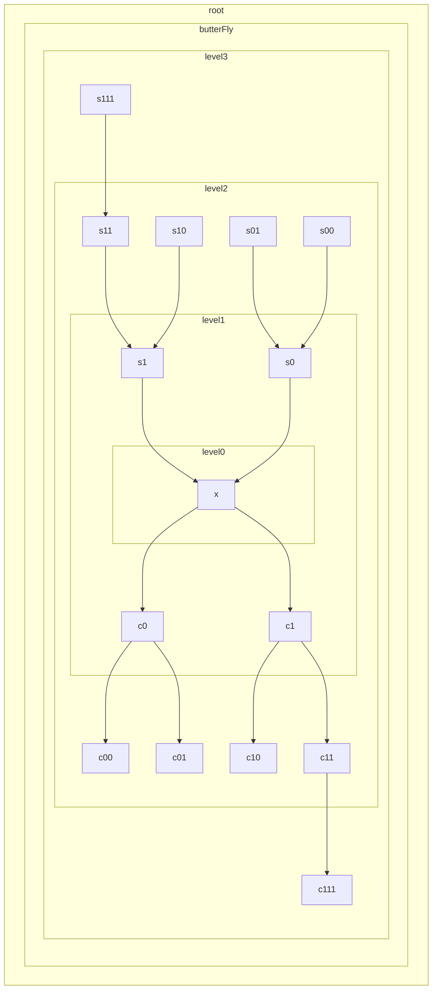

```mermaid
flowchart TD
  subgraph root_256["root"]
    subgraph butterFly_258["butterFly"]
      subgraph level3_260["level3"]
        s111_258["s111"]
        c111_272["c111"]
        subgraph level2_262["level2"]
          s11_259["s11"]
          s10_260["s10"]
          s01_261["s01"]
          s00_262["s00"]
          c00_268["c00"]
          c01_269["c01"]
          c10_270["c10"]
          c11_271["c11"]
          subgraph level1_264["level1"]
            s1_263["s1"]
            s0_264["s0"]
            c0_266["c0"]
            c1_267["c1"]
            subgraph level0_266["level0"]
              x_265["x"]
            end
          end
        end
      end
    end
  end

  s111_258 --> s11_259;
  s11_259 --> s1_263;
  s10_260 --> s1_263;
  s01_261 --> s0_264;
  s00_262 --> s0_264;
  c11_271 --> c111_272;
  s1_263 --> x_265;
  s0_264 --> x_265;
  c0_266 --> c00_268;
  c0_266 --> c01_269;
  c1_267 --> c10_270;
  c1_267 --> c11_271;
  x_265 --> c0_266;
  x_265 --> c1_267;

  classDef highlight fill:#FFFFAA,stroke:#333;
```