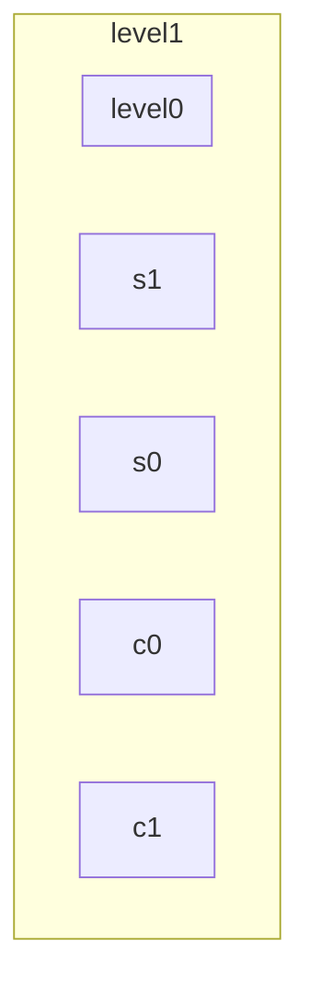

```mermaid
flowchart TD
  subgraph level1_292["level1"]
    s1_293["s1"]
    s0_294["s0"]
    c0_296["c0"]
    c1_297["c1"]
    subgraph level0_294["level0"]
    end
  end


  classDef highlight fill:#FFFFAA,stroke:#333;
```