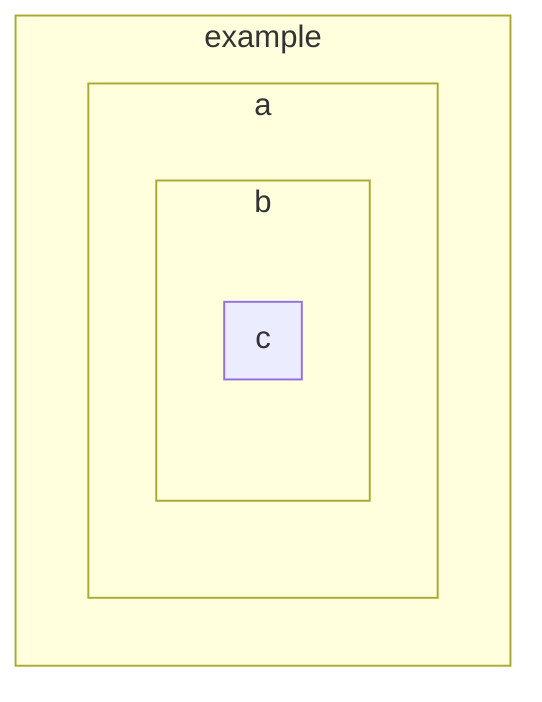

```mermaid
flowchart TD
  subgraph example_157["example"]
    subgraph a_158["a"]
      subgraph b_159["b"]
        subgraph c_160["c"]
        end
      end
    end
  end


  classDef highlight fill:#FFFFAA,stroke:#333;
```