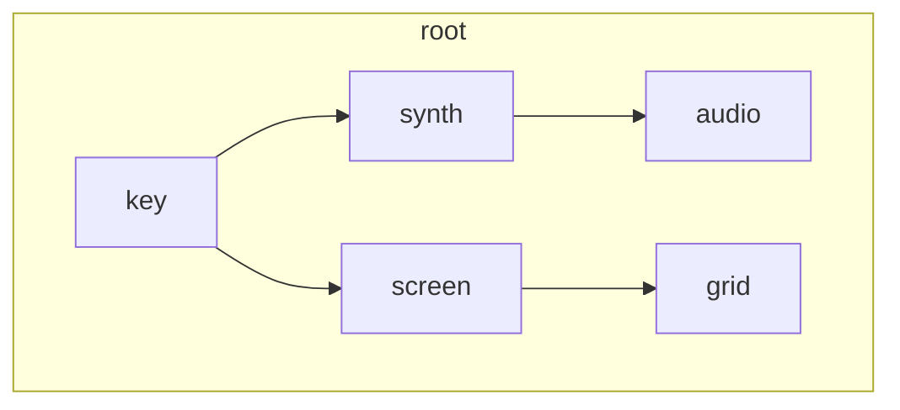

```mermaid
flowchart TD
  subgraph root_6["root"]
    key_4["key"]
    synth_5["synth"]
    audio_6["audio"]
    screen_7["screen"]
    grid_8["grid"]
  end

  key_4 --> synth_5;
  key_4 --> screen_7;
  synth_5 --> audio_6;
  screen_7 --> grid_8;

  classDef highlight fill:#FFFFAA,stroke:#333;
```